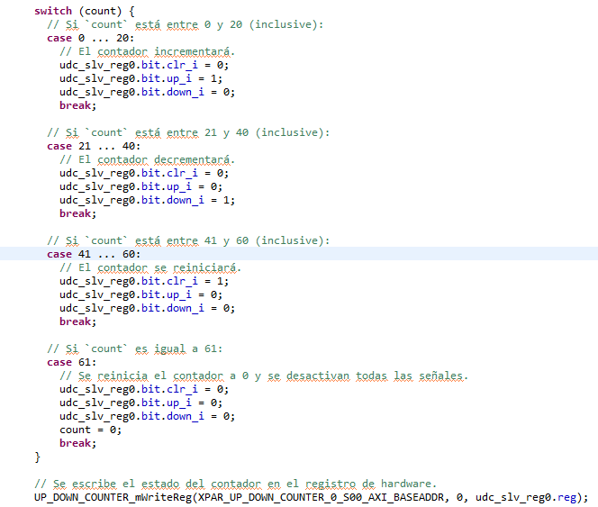

## **Trabajo práctico final**

## MICROARQUITECTURAS Y SOFTCORES

## Especialización en Sistemas Embebidos

Fernando Nicolas Calvet 

([fernando.n.calvet@gmail.com](mailto:apermingeat@gmail.com))

19/06/2024 

versión A

## Introduccion
Este proyecto tiene como objetivo crear un sistema digital que actúe como un contador, capaz de incrementar, decrementar su valor en función de los comandos recibidos a través de la interfaz AXI. Dicho módulo se hereda del diseñado en la materia Circuitos Logicos Programables.

El diseño se implementa en lenguaje VHDL (Very High Speed Integrated Circuit Hardware Description Language), que es un lenguaje de descripción de hardware utilizado para modelar y simular circuitos digitales.

El proyecto implica varias etapas, incluida la simulación del diseño para verificar su correcto funcionamiento. Finalmente, se crea un documento que documenta todo el proceso, incluyendo una explicación detallada del diseño, diagramas de bloques, capturas de simulaciones y resultados de la implementación en la FPGA.

## Diagrama general del hardware a implementar

## Descripción del funcionamiento

El módulo `**4 bit up/down counter**` representa el contador final. Este módulo cuenta con un reloj independiente que controla su funcionamiento de conteo. Además de eso, recibe las señales de control generadas por el `counter controller` para determinar si debe incrementar, decrementar o restablecer su valor.

## IP generado:

El IP creado recibe todas las señales por el registro Slave 0. Se decidió no popular el clock del sistema directamente en la funcionalidad del IP para que se pueda observar con más detenimiento su funcionamiento a través del VIO.

## Diagrama general

En el diagrama, además del IP generado, se agregaron los controladores GPIO para los botones y los switches de la placa (finalmente conectados a un VIO en esta ocasión para su manejo remoto). Además del IP Led generado en la cursada.

## Programacion

Se genero una union custom en C para el manejo bit a bit de cada uno de las entradas del IP \

 \

Ya que la asignación en el bloque en VHDL fue la siguiente: \
 \

De esta manera se puede ejecutar una secuencia de prueba comandada por un timer desde el core:

## Conclusiones

Es importante destacar que el desarrollo de este proyecto ha requerido un buen entendimiento de los principios de funcionamiento del hardware digital y FPGA. Si bien es un proyecto sencillo, me ha servido para comprender el “lenguaje” y la forma de trabajo que requiere esta tecnología.
